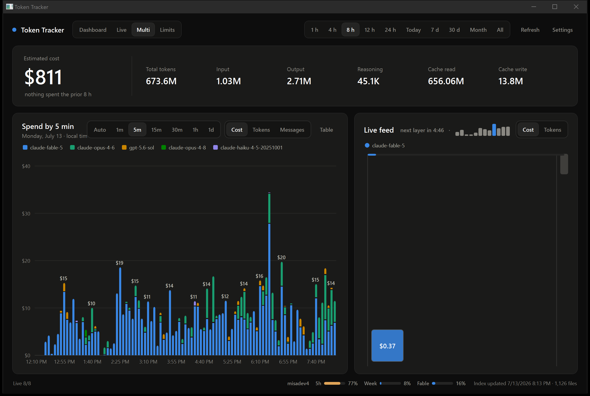

# Token Tracker

A native Windows dashboard for local AI token usage. Every Claude Code and Codex response on the machine is indexed locally, priced, charted, and animated the moment it lands — no accounts, no server, and nothing but API calls to fetch pricing and plan limits ever leaves the machine.

Double-click **`TokenTracker.exe`**. There is nothing to install. Closing the window leaves it running in the notification area; use the tray icon's **Exit** to stop it completely.

## Dashboard


The classic view: estimated cost with a comparison against the prior period, token totals (input, output, reasoning, cache), a stacked per-model timeline, and a by-model breakdown. Range presets (1 h up to All time) scope everything, and the bar size is yours to pick — 1-minute bars over the last hour, 15-minute bars over 8 hours, whatever combination fits; **Auto** chooses sensibly and sizes too fine for the range disable themselves. The chart flips between cost, token composition, and messages, every column has a full-breakdown tooltip, and a **Table** toggle shows the same numbers as text.

## Terminals

The bar under the header (visible on every tab) tracks each Claude Code terminal on the machine by tailing its session transcript: **green** means the turn finished and the terminal is sitting at the prompt, **blue** means it is mid-turn working, and **amber** means it has been quiet mid-turn for a while — usually a permission prompt waiting for an answer. No hooks or integration needed; state flips within a few seconds.

## Live


Ultra real time: every response drops into the cup as a block within about a second of being logged, sized by cost or token count with the value printed on it. Rounds are timed — the rim above the cup fills as the countdown runs (amber near the end, red just before), then the pile settles into a sediment layer, the floor rises, and the next round stacks on top. Scroll down through the layers to wander back in time; the small bars in the header score your recent rounds against your best. Round lengths run from 60 seconds to an hour, plus **∞ endless mode**, where nothing ever settles and the tower just keeps growing. Changing the round length re-partitions history instead of discarding it, and the live state keeps running in the background whatever tab is showing.

## Multi



The main chart, cost totals, and the live cup on one page — it is literally the same cup as the Live tab (same state, still interactive), moved into the dashboard's side column.

## Limits


Your Claude plan rate limits — the same numbers Claude Code shows under `/usage`: the 5-hour session window, the weekly all-models window, and per-model weekly windows, each with a severity-colored usage bar, a reset countdown, and a thin companion bar showing how far through the window you are. If several Claude accounts sign into Claude Code on this machine, each one gets its own card and keeps updating in the background between sign-ins. A compact copy of the signed-in account's meters lives in the status strip on every tab; click it to jump here.

## Data sources

The app reads local logs only:

- Codex sessions from `%USERPROFILE%\.codex`
- Claude Code projects and transcripts from `%USERPROFILE%\.claude`
- AI-bench trial streams (Claude Code against AWS Bedrock inside Docker sandboxes) from `Desktop\master\production\bench-results`, shown under the `bedrock` provider

A background watcher picks up new events within about a second, and a periodic reconcile catches anything the watcher missed. **Full rescan / repair** in Settings rebuilds the index from scratch.

## What gets stored, and where

Token metadata only — never prompt or response text — in `%LOCALAPPDATA%\TokenTracker`:

- `usage.db` — the local usage index (SQLite)
- `settings.json` — UI preferences
- `pricing-litellm.json` — cached pricing catalog
- `accounts.json` — per-account limit snapshots, including the OAuth tokens Claude Code already keeps in plaintext on this machine; they are only ever sent to the Anthropic API

Costs are estimated API list prices from LiteLLM's public catalog, refreshed when the cache is older than 24 hours. Estimates may differ from an actual invoice, subscription, or historical rate.

## Building

The full source lives in `source/`; it is not needed to run the exe. To rebuild with the .NET 10 SDK:

```powershell
dotnet publish source\TokenTracker.App.csproj -c Release -r win-x64 --self-contained true -p:PublishSingleFile=true -p:IncludeNativeLibrariesForSelfExtract=true -p:DebugType=None -o source\publish
```
