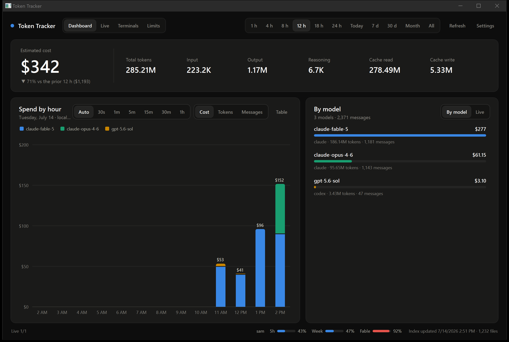
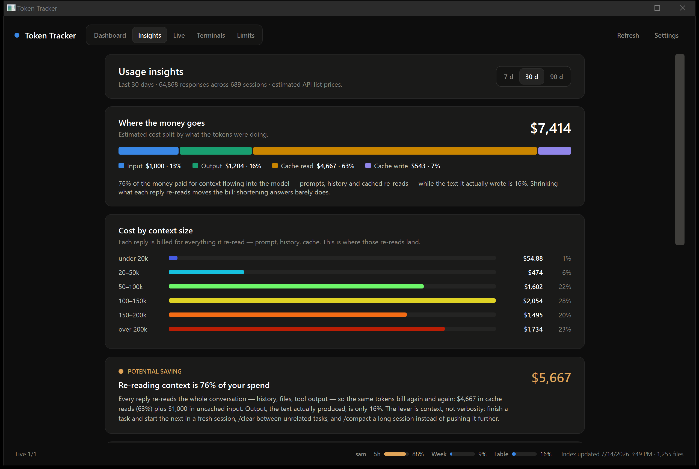
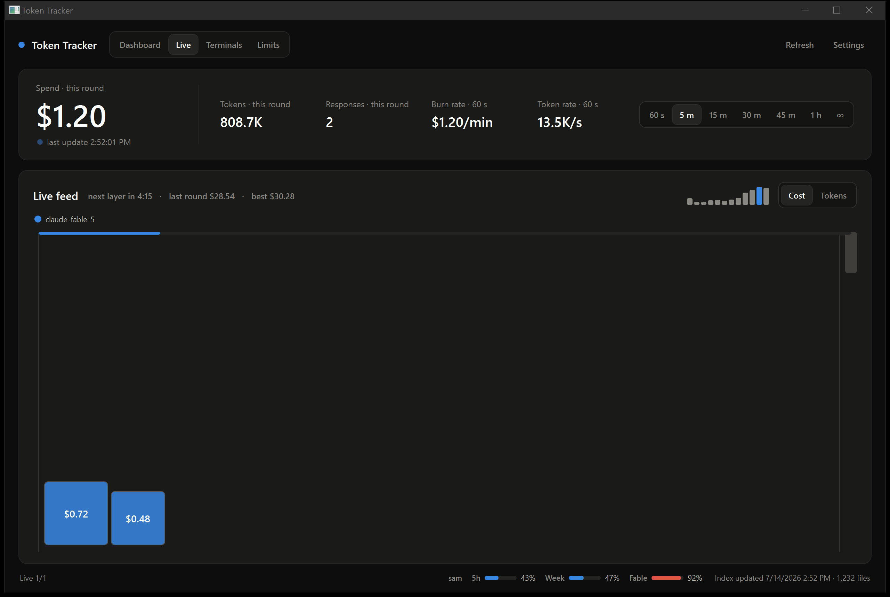
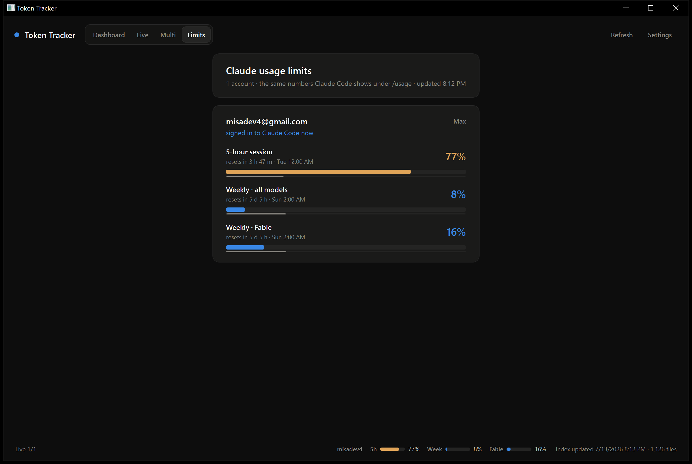

# Token Tracker

A native Windows dashboard for local AI token usage. Every Claude Code and Codex response on the machine is indexed locally, priced, charted, and animated the moment it lands — no accounts, no server, and nothing but API calls to fetch pricing and plan limits ever leaves the machine.

Double-click **`TokenTracker.exe`**. There is nothing to install. Closing the window leaves it running in the notification area; use the tray icon's **Exit** to stop it completely.

## Dashboard



The classic view: estimated cost with a comparison against the prior period, token totals (input, output, reasoning, cache), a stacked per-model timeline, and a by-model breakdown. Range presets (1 h up to All time) scope everything, and the bar size is yours to pick — down to 15-second bars over the last hour or minute bars across a half day, whatever combination fits; **Auto** chooses sensibly, and the selector only offers sizes that make sense for the current range (no 1-day bars on a 1-hour view). The chart flips between cost, token composition, and messages, every column has a full-breakdown tooltip, and a **Table** toggle shows the same numbers as text. A header toggle swaps the right panel between the **By model** breakdown and the **live cup** — the same cup as the Live tab, same state, still interactive — so the totals and the real-time view share one page.

## Insights



Where the money actually goes, and what the same work could cost. One stacked bar splits the estimated cost into input, output, cache read and cache write; a second card maps cost against how much context each reply re-read (on the same blue-to-red ramp as the activity grid), which is usually where the surprise lives — re-read context tends to dwarf the text the model actually writes. Below that, a set of rules speaks up only when your usage shows the pattern: context re-reads dominating the bill, long-context surcharges from crossing the 200k premium line, a few marathon sessions carrying most of the cost, cache re-warms after five-minute pauses, hidden reasoning tokens, a model mix that leans on the priciest tier, one runaway day — and, on the good-news side, what prompt caching saved you and how far your subscription beat API pricing. Every card carries real dollar figures computed from your own logs at API list prices; on a flat plan they measure rate-limit pressure and plan value rather than a bill. Ranges: 7, 30 or 90 days.

## Terminals

A page with one tile per **open** terminal — Claude Code and Codex, each wearing its maker's logomark so you can tell them apart at a glance. Claude Code terminals come from Claude Code's own live session registry, verified against the running processes (so closed terminals don't linger); Codex terminals are classified from their session rollouts and matched against running codex processes the same way. Tiles carry the same session names Claude Code uses: **green** means the terminal is sitting at the prompt, **blue** means it is mid-turn working — background agents count, so a turn that ended while its agents keep running stays blue — and **amber** means it wants attention: a permission prompt, a plan approval, or a turn gone quiet. Older Claude Code versions without the registry fall back to transcript-tail matching. No hooks or integration needed; states flip within a few seconds.

## Live



Ultra real time: every response drops into the cup as a block within about a second of being logged, sized by cost or token count with the value printed on it. Rounds are timed — the rim above the cup fills as the countdown runs (amber near the end, red just before), then the pile settles into a sediment layer, the floor rises, and the next round stacks on top. Scroll down through the layers to wander back in time; the small bars in the header score your recent rounds against your best. Round lengths run from 60 seconds to an hour, plus **∞ endless mode**, where nothing ever settles and the tower just keeps growing. Changing the round length re-partitions history instead of discarding it, and the live state keeps running in the background whatever tab is showing.

## Limits



Your Claude plan rate limits — the same numbers Claude Code shows under `/usage`: the 5-hour session window, the weekly all-models window, and per-model weekly windows, each with a severity-colored usage bar, a reset countdown, and a thin companion bar showing how far through the window you are. Each account card also names its exact plan tier (Max 5x · $100/mo vs Max 20x · $200/mo), which `/usage` doesn't show. If several Claude accounts sign into Claude Code on this machine, each one gets its own card and keeps updating in the background between sign-ins; an account that can no longer be fetched never shows stale numbers — once a window's reset time passes, its bar rolls forward to zero. Each card also shows how much local usage is attributed to that account over the last 7 days: transcripts carry no account identity, so the app records which account is signed in as it polls and attributes events by when they landed — accurate whenever the tracker was running, unknowable for periods it wasn't. A compact copy of the signed-in account's meters lives in the status strip on every tab; click it to jump here.

Above the account cards, a **Daily activity** grid maps a year of local usage GitHub-style — one cell per day, all clients combined, colored on a log-scaled blue-to-red ramp anchored to your biggest day, so only that day burns deep red. **Year** shows all twelve months at a glance; **Detail** enlarges recent months and prints each day's total on its cell. Both views switch between tokens and cost, and hovering any cell breaks the day down.

## Data sources

The app reads local logs only:

- Codex sessions from `%USERPROFILE%\.codex`
- Claude Code projects and transcripts from `%USERPROFILE%\.claude`
- AI-bench trial streams (Claude Code against AWS Bedrock inside Docker sandboxes) from `Desktop\master\production\bench-results`, shown under the `bedrock` provider

A background watcher picks up new events within about a second, and a periodic reconcile catches anything the watcher missed. **Full rescan / repair** in Settings rebuilds the index from scratch.

## What gets stored, and where

Token metadata only — never prompt or response text — in `%LOCALAPPDATA%\TokenTracker`:

- `usage.db` — the local usage index (SQLite)
- `settings.json` — UI preferences
- `pricing-litellm.json` — cached pricing catalog
- `accounts.json` — per-account limit snapshots, including the OAuth tokens Claude Code already keeps in plaintext on this machine; they are only ever sent to the Anthropic API

Costs are estimated API list prices from LiteLLM's public catalog, refreshed when the cache is older than 24 hours. Estimates may differ from an actual invoice, subscription, or historical rate.

## Building

The full source lives in `source/`; it is not needed to run the exe. To rebuild with the .NET 10 SDK:

```powershell
dotnet publish source\TokenTracker.App.csproj -c Release -r win-x64 --self-contained true -p:PublishSingleFile=true -p:IncludeNativeLibrariesForSelfExtract=true -p:DebugType=None -o source\publish
```
